# Análisis Estadístico de una Base de Datos de Películas

## 1. Datos

En el archivo `movie-profits.txt` hay observaciones de 609 películas estrenadas en Estados Unidos. Para cada una se registran:

- **Year**: año de la película.
- **Movie**: nombre de la película.
- **US Gross ($M)**: recaudación en Estados Unidos en millones de dólares.
- **Budget ($M)**: presupuesto de la película.
- **Run Time (min)**: tiempo de duración en minutos.
- **Critic Score (Rotten Tomatoes)**: puntuación de la crítica según Rotten Tomatoes.

## 2. Trabajo Asignado

Para este grupo de variables se solicita el siguiente trabajo:

1. Realizar un análisis descriptivo de los datos.
2. Realizar un intervalo de confianza del 97% para la media de cada variable en estudio. Analizar lo obtenido.
3. Probar, a un nivel de 0.05, que el promedio de la puntuación de la crítica es superior a 50.
4. Realizar una prueba de bondad de ajuste para determinar si la variable US Gross tiene distribución normal.
5. Realizar un gráfico de dispersión y una matriz de correlación de las variables.
6. Estudiar si la correlación entre la recaudación y el presupuesto de las películas es positiva.
7. Hacer un muestreo para dividir los datos en dos subconjuntos, uno con 80% y otro con 20% de los datos.
8. Con el subconjunto del 80% de los datos, hallar un modelo lineal que explique mejor la variable US Gross, e incluir todas las pruebas necesarias para llegar a este modelo, así como un análisis de residuos del modelo final.
9. Con los datos del 20% restante, hacer una predicción de la variable US Gross (con el mejor modelo en general) y hacer un resumen estadístico de los residuos de predicción (valor observado vs. predicción del modelo) para concluir con relación al poder predictivo del modelo.
10. Hacer análisis de varianza para estudiar si US Gross, Budget, Run Time y Critic Score tienen promedios iguales según el año de la película.

- Lenguaje utilizado: *```R```*
- Proyecto realizado en la materia: *```Estadística para ingeniería```*

### Gráficas:

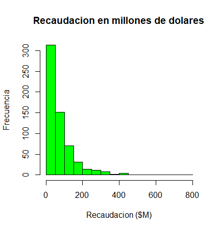
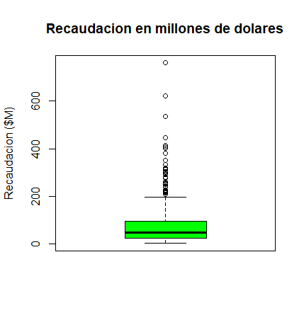
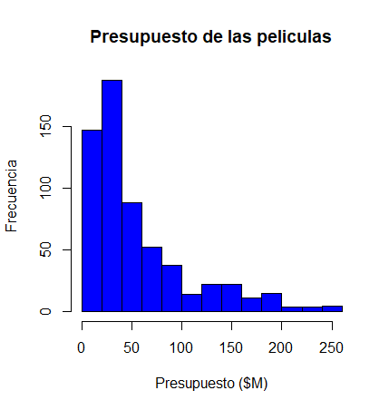
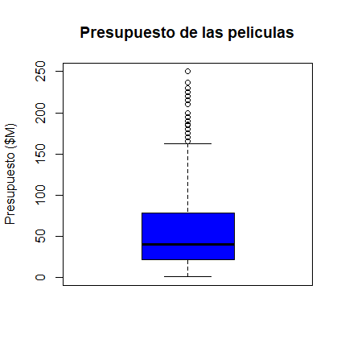
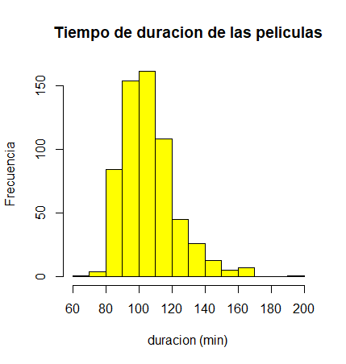
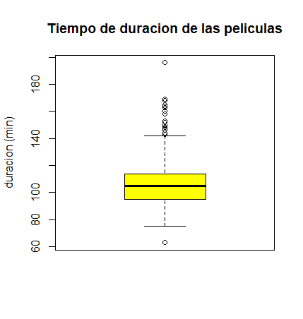
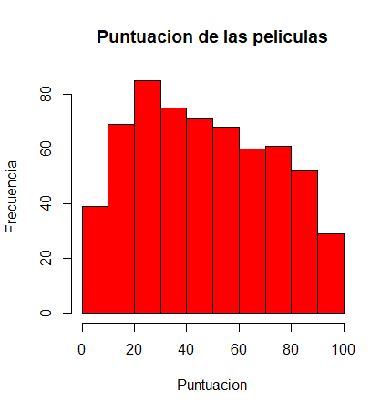
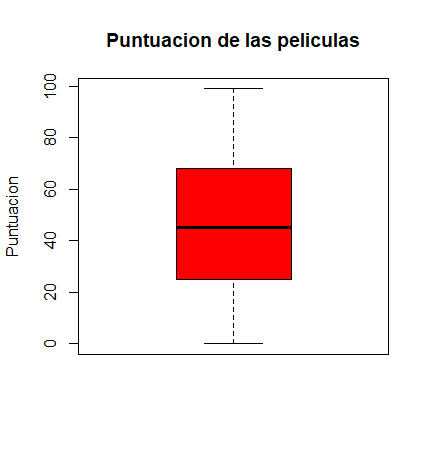

### Boxplots:

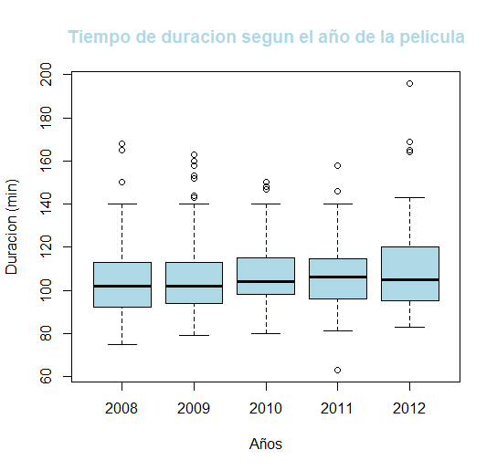
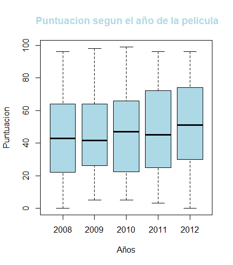
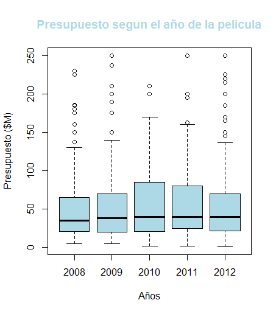
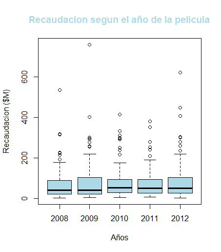

### Gráficos residuales:


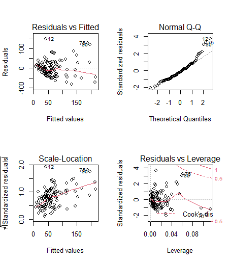

### Gráfico de dispersión:


